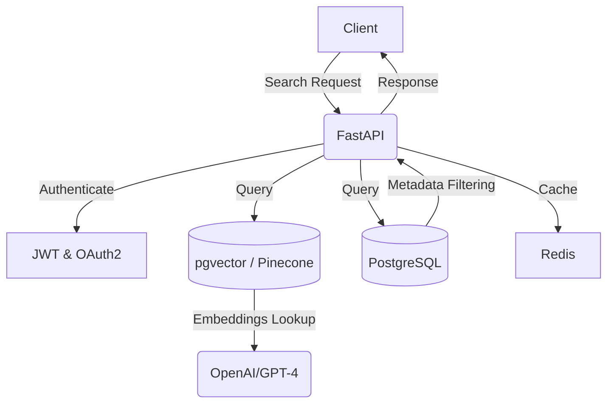

# 🚀 Building Enterprise-Grade RESTful APIs with FastAPI & LLM Integrations

## 1️⃣ Problem Scenario (Contexto NBCU)

Imagine handling **real-time content recommendations** across **10M+ users** on a streaming platform. Traditional search mechanisms fall short in:

- Understanding user intent beyond keywords.
- Handling dynamic content personalization efficiently.
- Scaling recommendations with low latency.

📌 **Solution:** Leverage **FastAPI + LLM-based Retrieval-Augmented Generation (RAG)** for an enterprise-grade, AI-driven recommendation API.

---

## 2️⃣ Architecture Design



### Key Architecture Patterns:
✅ **JWT Authentication**: Secure user authentication.
✅ **Rate Limiting**: Prevent abuse & ensure scalability.
✅ **RAG (Retrieval-Augmented Generation)**: Hybrid search with **vector embeddings + metadata filtering**.

---

## 3️⃣ Code Deep Dive

### 🔹 A. FastAPI Core Implementation

```python
from fastapi import FastAPI, Depends, HTTPException
from pydantic import BaseModel, Field
from auth import JWTBearer  # Secure JWT Authentication
from search_engine import hybrid_search_engine

app = FastAPI()

class ContentQuery(BaseModel):
    user_id: str
    search_term: str = Field(..., min_length=3, example="sci-fi movies")

@app.post("/v1/content/search", dependencies=[Depends(JWTBearer())])
async def search_content(query: ContentQuery):
    """
    Hybrid search:
    1. Vector DB (NoSQL) → Semantic similarity via LLM embeddings
    2. SQL → Filter by metadata (genre, ratings)
    """
    results = await hybrid_search_engine(query)
    return {"results": results, "query_optimized_by": "pgvector + OpenAI embeddings"}
```

### 🔹 B. Hybrid Search Engine Implementation

```python
import asyncpg
import openai
from vector_db import query_vector_db

async def hybrid_search_engine(query):
    # Step 1: Vector DB search (semantic matching)
    vector_results = await query_vector_db(query.search_term)
    
    # Step 2: SQL metadata filtering
    sql_results = await filter_metadata(query.user_id, query.search_term)
    
    return sorted(vector_results + sql_results, key=lambda x: x['relevance'], reverse=True)

async def filter_metadata(user_id, search_term):
    conn = await asyncpg.connect(dsn="postgres://user:pass@db:5432/content")
    query = """
    SELECT title, genre, rating FROM content
    WHERE genre ILIKE $1 OR title ILIKE $2
    """
    rows = await conn.fetch(query, f"%{search_term}%", f"%{search_term}%")
    await conn.close()
    return [{"title": row["title"], "genre": row["genre"], "relevance": row["rating"]} for row in rows]
```

### 🔹 C. Deploying with Docker & Kubernetes

#### `Dockerfile`
```dockerfile
FROM python:3.9-slim
WORKDIR /app
COPY requirements.txt .
RUN pip install --no-cache-dir -r requirements.txt
COPY . .
CMD ["uvicorn", "main:app", "--host", "0.0.0.0", "--port", "8000"]
```

#### `k8s-deployment.yaml`
```yaml
apiVersion: apps/v1
kind: Deployment
metadata:
  name: fastapi-llm-service
spec:
  replicas: 3
  selector:
    matchLabels:
      app: fastapi-llm
  template:
    metadata:
      labels:
        app: fastapi-llm
    spec:
      containers:
        - name: fastapi-llm
          image: myregistry/fastapi-llm:latest
          ports:
            - containerPort: 8000
          env:
            - name: DATABASE_URL
              value: "postgres://user:pass@db:5432/content"
```

---

## 4️⃣ Summary & Next Steps

🎯 **Key Takeaways:**
- ✅ **FastAPI + JWT Auth** → Secure & scalable API.
- ✅ **Hybrid Search (Vector DB + SQL)** → Accurate AI-driven recommendations.
- ✅ **Deploy with Docker & Kubernetes** → Enterprise-ready microservices.

