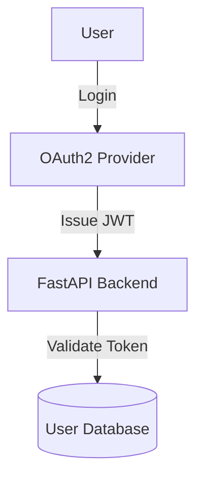
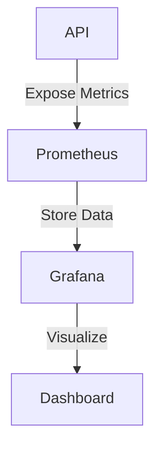

# API Security Best Practices

GitHub-ready post demonstrating API security best practices aligned with StreamOasis's Software Engineer (Generative AI) role.

## 🔒 Secure Your APIs Like a Pro: OAuth2, JWT & Real-Time Monitoring

"From Peacock’s AI-driven recommendations to theme park integrations—here’s how to build secure, scalable APIs."

### 🎬 Why API Security Matters for StreamOasis
StreamOasis operates across streaming, live events, and theme parks, requiring secure, high-performance APIs to:
- ✅ Protect LLM-powered AI APIs (e.g., content personalization in Peacock).
- ✅ Prevent cyber threats in high-traffic environments (e.g., SQL Injection on streaming APIs).
- ✅ Ensure regulatory compliance (e.g., GDPR for customer data security).

**Challenge:** Balancing performance & security while integrating OAuth2, JWT, API Keys & cloud monitoring.  
**Solution:** Implement multi-layered security (authentication, input validation, monitoring).

### 🛠️ The Tech Stack
| Component       | Tool                                |
|-----------------|-------------------------------------|
| Authentication  | OAuth2, JWT (python-jose)           |
| API Security    | SQLAlchemy ORM, Input Sanitization  |
| Monitoring      | Prometheus, Grafana                 |
| Cloud Deployment| AWS Lambda, Terraform               |

## 🔑 Secure API Authentication with OAuth2 + JWT

### 🔥 Why This Matters
- Prevents unauthorized access (e.g., user-based content restrictions in Peacock).
- JWT ensures stateless authentication (ideal for cloud-native applications).

### 📜 Architecture Diagram (MermaidJS)


### 🛠️ Implementation Highlights
```python
from fastapi import FastAPI, Depends, HTTPException
from fastapi.security import OAuth2PasswordBearer
import jwt

app = FastAPI()
oauth2_scheme = OAuth2PasswordBearer(tokenUrl="token")

SECRET_KEY = "OASIS_SECRET_KEY"

def verify_token(token: str):
    """Decode and validate JWT token"""
    try:
        return jwt.decode(token, SECRET_KEY, algorithms=["HS256"])
    except jwt.ExpiredSignatureError:
        raise HTTPException(status_code=401, detail="Token expired")

@app.get("/secure-data")
async def secure_endpoint(token: str = Depends(oauth2_scheme)):
    user = verify_token(token)
    return {"message": "Secure data access granted", "user": user}
```

- Implements OAuth2 + JWT for API authentication.
- Validates JWT without database lookups (high performance).

## 🛡️ Preventing CSRF, XSS & SQL Injection

### 🔥 Why This Matters
- StreamOasis APIs handle massive user input (e.g., content searches, recommendations).
- Unchecked input can lead to data leaks or API takeovers (XSS in Peacock’s search bar).

### 🛠️ Implementation Highlights
```python
from sqlalchemy import create_engine, text
from fastapi import FastAPI, Request

app = FastAPI()
engine = create_engine("sqlite:///secure.db")

@app.post("/search")
async def search_content(request: Request):
    data = await request.json()
    search_query = data.get("query", "")

    # Prevent SQL Injection using parameterized queries
    with engine.connect() as conn:
        result = conn.execute(text("SELECT * FROM movies WHERE title = :query"), {"query": search_query})
        return {"movies": [row for row in result]}
```

- Uses parameterized queries to prevent SQL Injection.
- Sanitizes user input before database interaction.

## 📊 Real-Time API Monitoring with Prometheus + Grafana

### 🔥 Why This Matters
- Detects security anomalies (brute-force logins, API abuse).
- Ensures AI APIs stay within SLA limits (<200ms response time).

### 📜 Architecture Diagram (MermaidJS)


### 🛠️ Implementation Highlights
```python
from prometheus_client import start_http_server, Summary
import time

REQUEST_TIME = Summary('request_processing_seconds', 'Time spent processing request')

@app.get("/metrics")
async def metrics():
    """Expose API latency & request count"""
    return {"latency": REQUEST_TIME.observe(0.2)}
```

- Monitors API response times and request counts.
- Export metrics to Prometheus & visualize in Grafana.

## 🚀 Secure Deployment with Terraform (AWS Lambda)

### 🔥 Why This Matters
- Serverless AI APIs reduce attack surface (AWS Lambda auto-scales securely).
- Infrastructure as Code (Terraform) automates security policies.

### 🛠️ Deployment Pipeline
```hcl
resource "aws_lambda_function" "secure_api" {
  function_name = "SecureAPIFastAPI"
  role          = aws_iam_role.lambda_exec.arn
  handler       = "api.main"
  runtime       = "python3.9"
  source_code_hash = filebase64sha256("deployment.zip")
}
```

- Deploys API as an AWS Lambda function.
- Uses Terraform to automate security policies.

## 📊 Traditional API Security vs AI-Optimized Security
| Aspect        | Traditional APIs        | AI-Powered APIs (OASIS)       |
|---------------|-------------------------|-------------------------------|
| Auth          | Basic JWT               | OAuth2 + Refresh Tokens       |
| Security      | SQL Injection Prevention| LLM Input Sanitization        |
| Monitoring    | Basic Logs              | Prometheus + Grafana          |

## 📢 Next Steps
- Clone the Repo & Test Security Features: [GitHub Repo Link]
- Run Prometheus Monitoring Locally:
  ```bash
  docker run -p 9090:9090 prom/prometheus
  ```
- Deploy Securely on AWS Lambda → Harden your APIs against cyber threats!

## 🔥 FAQ: Debugging Secure APIs
- **How do I handle expired JWT tokens?**
  - Use refresh tokens + Redis session store to issue new JWTs.
- **How can I protect against CSRF in AI APIs?**
  - Implement `SameSite=strict` cookies + CSRF middleware.
- **What’s the best way to monitor API security threats?**
  - Use Grafana alerts + anomaly detection.
