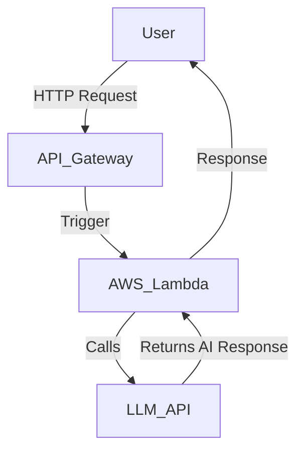
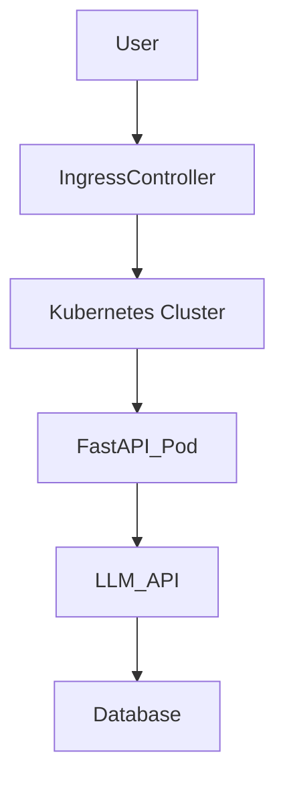
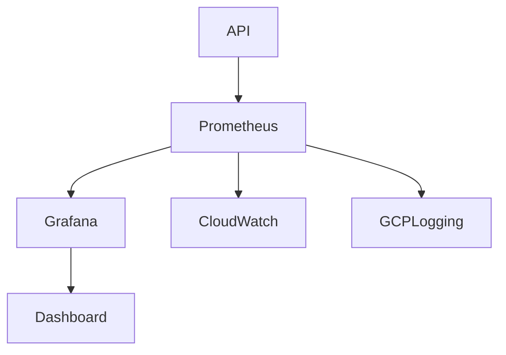

# Serverless AI Workflows using AWS Lambda, Kubernetes, and LLM APIs

Here’s a GitHub-ready tutorial that showcases serverless AI workflows using AWS Lambda, Kubernetes, and LLM APIs, aligned with StreamOasis’s Software Engineer (Generative AI) role.

## 🚀 Serverless AI Workflows: Deploying LLM APIs with AWS Lambda & Kubernetes

"How StreamOasis can scale generative AI across TV, film, and theme parks with cloud-native deployments."

### 🎬 Why Serverless + Kubernetes Matter for Generative AI
StreamOasis’s AI-powered systems require scalable, high-availability APIs for:
- ✅ Real-time content recommendations (e.g., Peacock streaming AI).
- ✅ Interactive theme park assistants (e.g., LLM chatbots for ride recommendations).
- ✅ Automated film metadata tagging (e.g., ML-driven video indexing for StreamOasis Studios).

**Challenges:**
- Scalability: AI APIs must handle high traffic surges (e.g., live sports events).
- Cost Optimization: Serverless execution eliminates idle infrastructure costs.
- Observability: CloudWatch, Prometheus, and GCP Logging ensure system health.

**Solution:** Deploy FastAPI-based LLM APIs on AWS Lambda & Kubernetes for maximum efficiency.

### 🛠️ Tech Stack
| Component              | Tool                                     |
|------------------------|------------------------------------------|
| API Framework          | FastAPI                                  |
| Serverless Deployment  | AWS Lambda, Serverless Framework         |
| Container Orchestration| Kubernetes (EKS, GKE, AKS)               |
| LLM API Integration    | OpenAI API, Hugging Face                 |
| Monitoring             | Prometheus, AWS CloudWatch, GCP Logging  |

## 🔗 Serverless LLM API with AWS Lambda

### 🔥 Why This Matters
- Auto-scales AI workloads (ideal for fluctuating demand on streaming services).
- Reduces cloud costs (pay-per-execution pricing).
- Ensures high availability (integrates with API Gateway).

### 📜 Architecture Diagram (MermaidJS)


### 🛠️ Implementation Highlights
```python
from fastapi import FastAPI
import openai
import os

app = FastAPI()

OPENAI_API_KEY = os.getenv("OPENAI_API_KEY")

@app.post("/generate")
async def generate_text(prompt: str):
    """Generate AI response using OpenAI's LLM"""
    response = openai.ChatCompletion.create(
        model="gpt-4",
        messages=[{"role": "user", "content": prompt}],
        stream=True
    )
    return {"text": response.choices[0].message.content}
```

- Deploys as an AWS Lambda function with serverless.yml configuration.

## 🚀 Deploying AI API to AWS Lambda

### 🛠️ Serverless Framework (serverless.yml)
```yaml
service: generative-ai-api

provider:
  name: aws
  runtime: python3.9

functions:
  generate:
    handler: app.generate_text
    events:
      - http:
          path: generate
          method: post
```

- Enables serverless execution of LLM API requests.
- **Next Step:** Deploy using Serverless Framework
  ```bash
  serverless deploy
  ```

## 📦 Scaling LLM Workloads with Kubernetes

### 🔥 Why This Matters
- Handles sustained high-volume AI requests (e.g., 24/7 streaming metadata processing).
- Supports GPU-accelerated AI models (for complex LLM inferences).
- Runs in hybrid cloud environments (AWS, Azure, GCP).

### 📜 Kubernetes Deployment Diagram (MermaidJS)


### 🛠️ Implementation Highlights
```yaml
apiVersion: apps/v1
kind: Deployment
metadata:
  name: llm-api
spec:
  replicas: 3
  selector:
    matchLabels:
      app: llm-api
  template:
    metadata:
      labels:
        app: llm-api
    spec:
      containers:
        - name: llm-api
          image: myrepo/llm-api:latest
          ports:
            - containerPort: 80
```

- Deploys AI-powered API as a scalable microservice on Kubernetes.
- **Next Step:** Deploy using kubectl
  ```bash
  kubectl apply -f deployment.yaml
  ```

## 📊 Real-Time AI API Monitoring

### 🔥 Why This Matters
- Prevents system failures during peak traffic (e.g., Olympics live-streaming AI).
- Optimizes API performance (identify LLM response bottlenecks).
- Ensures regulatory compliance (GDPR, data retention policies).

### 📜 Monitoring Diagram (MermaidJS)


### 🛠️ Implementation Highlights
```yaml
global:
  scrape_interval: 15s

scrape_configs:
  - job_name: 'llm-api'
    static_configs:
      - targets: ['llm-api-service:80']
```

- Monitors API response times & error rates.
- **Next Step:** Deploy Prometheus & Grafana
  ```bash
  kubectl apply -f prometheus-config.yaml
  ```

## 📊 AWS CloudWatch Setup for Lambda Monitoring

### 🛠️ AWS CloudWatch Alarm for API Errors
```bash
aws cloudwatch put-metric-alarm \
  --alarm-name "LambdaHighErrors" \
  --metric-name Errors \
  --namespace AWS/Lambda \
  --statistic Sum \
  --period 300 \
  --threshold 5 \
  --comparison-operator GreaterThanThreshold
```

- Alerts engineers if Lambda error rate exceeds 5 failures.

## 💡 Traditional vs. AI-Native Cloud Deployments

| Feature           | Traditional Cloud           | AI-Native (StreamOasis)          |
|-------------------|-----------------------------|----------------------------------|
| Compute Model     | Fixed VM Instances          | Serverless + Kubernetes          |
| Scalability       | Manual Autoscaling          | AI-Optimized Dynamic Scaling     |
| Monitoring        | Logs & Alerts               | AI-Specific Metrics (LLM Tokens, Latency) |

## 📢 Next Steps
- Clone the Repo & Deploy: [GitHub Repo Link]
- Deploy AWS Lambda AI API:
  ```bash
  serverless deploy
  ```
- Run Kubernetes AI API Locally:
  ```bash
  kubectl apply -f deployment.yaml
  ```
- Set Up Monitoring:
  ```bash
  kubectl apply -f prometheus-config.yaml
  ```

## 🔥 FAQ: Debugging AI Cloud Deployments
- **Why does my Lambda AI API have high cold start latency?**
  - Use AWS Lambda provisioned concurrency to pre-warm instances.
- **How do I handle Kubernetes pod failures?**
  - Enable Kubernetes Horizontal Pod Autoscaler (HPA).
- **What’s the best way to reduce LLM inference costs?**
  - Use quantized models (e.g., GPT-3.5-Turbo) & caching strategies.
