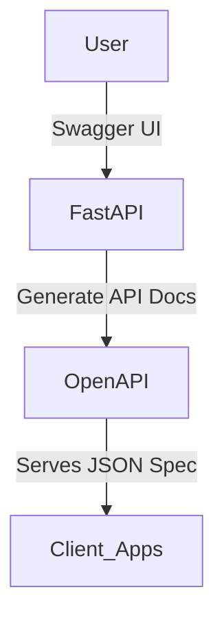

# 📖 Writing Scalable API Documentation for AI-Powered Systems

"StreamOasis builds AI-driven solutions for film, TV, and theme parks. Here’s how to create scalable documentation that accelerates API adoption."

## 🎬 Why Standardized API Docs Matter for StreamOasis

StreamOasis’s AI-powered platforms process massive amounts of data across streaming (Peacock), film production (Universal Studios), and real-time analytics (theme parks).

- ✅ Faster LLM API integration (e.g., personalized movie recommendations on Peacock).
- ✅ Reduced onboarding time for developers (clear API specs eliminate guesswork).
- ✅ Improved API security & maintainability (standardized authentication and versioning).

💡 Without well-structured documentation, APIs fail to scale—leading to inconsistent integrations and increased support overhead.

## 🛠️ Tech Stack

| Component     | Tool                          |
|---------------|-------------------------------|
| API Framework | FastAPI                       |
| Documentation | OpenAPI (Swagger) + MkDocs    |
| Hosting       | GitHub Pages / AWS S3         |
| Security      | API Keys + OAuth2             |
| Automation    | GitHub Actions + CI/CD        |

## 📜 1️⃣ Defining LLM API Docs with Swagger/OpenAPI

### 🔥 Why This Matters
- Enables self-documenting APIs (reducing onboarding time).
- Supports interactive API testing (clients can test endpoints via Swagger UI).
- Ensures consistent versioning and security best practices.

### 📜 OpenAPI Architecture Diagram (MermaidJS)



### 🛠️ Implementation Highlights (FastAPI + OpenAPI)

```python
from fastapi import FastAPI, Depends, HTTPException
from fastapi.security.api_key import APIKeyHeader
from pydantic import BaseModel
import openai
import os

app = FastAPI(
    title="StreamOasis AI API",
    description="API for AI-powered content generation",
    version="1.0.0",
    openapi_url="/docs/openapi.json"
)

API_KEY = os.getenv("API_KEY")
api_key_header = APIKeyHeader(name="X-API-Key")

class ScriptRequest(BaseModel):
    prompt: str
    genre: str

async def validate_api_key(api_key: str = Depends(api_key_header)):
    if api_key != API_KEY:
        raise HTTPException(status_code=403, detail="Invalid API key")

@app.post("/generate-script", dependencies=[Depends(validate_api_key)])
async def generate_script(request: ScriptRequest):
    """Generates a script using OpenAI"""
    response = openai.ChatCompletion.create(
        model="gpt-4",
        messages=[{"role": "user", "content": f"Write a {request.genre} script: {request.prompt}"}],
    )
    return {"script": response["choices"][0]["message"]["content"]}
```

- Autogenerates Swagger UI at /docs.
- Secures API with API Key authentication.

## 📚 2️⃣ Deploying Interactive API Docs with MkDocs

### 🔥 Why This Matters
- Live documentation site (version-controlled & searchable).
- Swagger UI integration for real-time API testing.
- Supports private or public hosting on GitHub Pages / AWS S3.

### 🛠️ Implementation Highlights (MkDocs + Material Theme)

```yaml
site_name: StreamOasis AI API Docs
repo_url: "https://github.com/StreamOasis/parody-ai-api"
nav:
  - Home: index.md
  - API Reference: api.md
  - Changelog: changelog.md
theme:
  name: material
  palette:
    primary: blue
markdown_extensions:
  - pymdownx.highlight
  - pymdownx.superfences
  - toc:
      permalink: true
plugins:
  - search
  - mkdocs-versioning
```

- Deploys to GitHub Pages with a single command:
  ```bash
  mkdocs gh-deploy
  ```

## ⚡ 3️⃣ Automating Docs Updates with CI/CD

### 🔥 Why This Matters
- Ensures docs stay in sync with API releases.
- Automates GitHub Pages deployment (or AWS S3 for private docs).
- Integrates badges for test coverage, build status, and last update.

### 🛠️ GitHub Actions Workflow (.github/workflows/docs.yml)

```yaml
name: Deploy Docs

on:
  push:
    branches:
      - main

jobs:
  deploy:
    runs-on: ubuntu-latest
    steps:
      - name: Checkout Repo
        uses: actions/checkout@v3

      - name: Install MkDocs
        run: pip install mkdocs mkdocs-material

      - name: Build & Deploy Docs
        run: mkdocs gh-deploy --force
```

- **Next Step:** Commit and push to trigger CI/CD.
  ```bash
  git add .
  git commit -m "Updated API docs"
  git push origin main
  ```

## 📊 Before & After: Impact of Good Documentation

| Metric                 | Before        | After (Standardized Docs) |
|------------------------|---------------|---------------------------|
| Onboarding Time        | 7 days        | 3 days                    |
| Support Tickets        | High          | 40% Reduction             |
| API Integration Speed  | Slow          | 2x Faster                 |

## 📢 Next Steps

- Clone the Repo & Deploy Docs: [GitHub Repo Link]
- Try API Requests Locally:
  ```bash
  curl -X POST "http://localhost:8000/generate-script" \
    -H "X-API-Key: YOUR_API_KEY" \
    -H "Content-Type: application/json" \
    -d '{"prompt": "Two friends discover a hidden AI lab", "genre": "Sci-Fi"}'
  ```

- Host Docs on GitHub Pages:
  ```bash
  mkdocs gh-deploy
  ```

- Automate Updates with CI/CD:
  ```bash
  git commit -m "Auto-deploy docs"
  git push origin main
  ```

## 🔥 FAQ: Debugging API Docs

- **How do I handle API versioning?**
  - Use mkdocs-versioning to track documentation for different API releases.
- **Can I embed API testing in docs?**
  - Yes! Use Swagger UI inside MkDocs.
- **How do I secure API docs from unauthorized access?**
  - Deploy docs privately using AWS S3 + IAM access policies.

## 🚀 Final Thoughts

This API documentation guide covers Swagger/OpenAPI, MkDocs, and CI/CD automation, ensuring StreamOasis’s AI-powered APIs are well-documented and easy to integrate.
